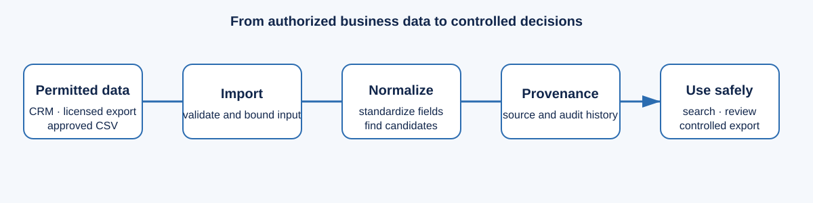

# Lociqua

> A self-hosted business directory for company data you are allowed to use.



Business teams often inherit CRM exports, customer lists, partner files, and
approved datasets that are difficult to search, contain duplicate records, and
lose their source history. Lociqua turns permitted business data into a
searchable, traceable directory without pretending that every business on the
internet is available or collectable.

## What Lociqua does

- Imports bounded UTF-8 CSV data and records source metadata.
- Normalizes common company fields and supports multi-location search.
- Preserves source records, field provenance, quality indicators, and audit
  history.
- Presents explainable duplicate candidates for human review; decisions do not
  merge or delete either company.
- Provides viewer, editor, and owner roles in the PostgreSQL/Redis production
  profile.
- Supports self-hosting with Docker Compose, health checks, metrics, structured
  logs, backup/restore helpers, and an optional generic alert webhook.

## What Lociqua does not do

- It does not scrape restricted sources, bypass access controls, solve CAPTCHAs,
  rotate proxies, or automate browser collection.
- It does not claim a global business directory, verified company truth, or
  automatic legal compliance.
- It does not destructively merge records based on duplicate suggestions.
- It is a self-hosted, single-configured-workspace application, not a hosted
  multi-tenant SaaS product.

## Choose your path

| Goal | Start here |
| --- | --- |
| I want to understand the problem | [What problem Lociqua solves](docs/WHAT_PROBLEM.md) and [use cases](docs/USE_CASES.md) |
| I want to use the application | [User guide](docs/USER_GUIDE.md) |
| I want to self-host it | [Self-hosting guide](docs/SELF_HOSTING.md) and [operations runbook](docs/OPERATIONS.md) |
| I need data-rights guidance | [Security and data rights](docs/SECURITY_AND_DATA_RIGHTS.md) |
| I want to build or contribute | [Architecture](docs/ARCHITECTURE.md), [API reference](docs/API.md), and [contributing guide](CONTRIBUTING.md) |

## Quick start

Python 3.11+ is required. The production profile uses PostgreSQL/PostGIS and
Redis; local development can use SQLite.

```powershell
python -m pip install -e .
python -m unittest discover -s tests -v
```

For a production-style local stack, copy `.env.example` to a private `.env`,
replace every example secret, and run:

```powershell
docker compose -f docker-compose.production.yml up --build -d --remove-orphans
Invoke-WebRequest http://127.0.0.1/healthz
```

Open `http://127.0.0.1/` and sign in with the local bootstrap account. See the
[self-hosting guide](docs/SELF_HOSTING.md) before exposing the service publicly.

## Data rights and safety

Only import data you own, receive with permission, or use under a license that
permits the intended collection, retention, search, export, and redistribution.
The Apache-2.0 license covers repository code and contributed assets; it does
not grant rights to third-party data, brands, personal information, or contracts.
Read [security and data rights](docs/SECURITY_AND_DATA_RIGHTS.md) before a real
deployment.

## Documentation

The complete documentation index is at [docs/README.md](docs/README.md). It
includes user workflows, deployment, operations, production testing, release
checks, architecture, API details, and original-asset provenance.

## Status and release discipline

The repository includes a production-oriented Compose profile, but a truthful
production-readiness claim still requires verification in the target environment:
authenticated load testing, backup/restore drills, recovery tests, HTTPS and
identity-boundary checks, alert delivery, and secret rotation. See
[production testing](docs/PRODUCTION_TESTING.md) and the
[release checklist](docs/RELEASE_CHECKLIST.md).
