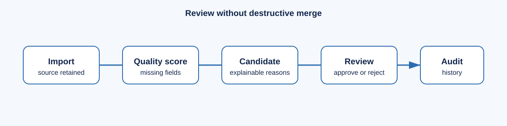

# Lociqua feature guide

| Area | Available now | Optional or operator configured | Not included |
| --- | --- | --- | --- |
| Data intake | Bounded UTF-8 CSV import and source registry | Owner-approved browser evidence, official APIs, licensed feeds, and open-data adapters | Restricted-source scraping or bypasses |
| Search | Concurrent multi-location local search | Redis-backed queued search jobs | Guaranteed global business coverage |
| Data trust | Normalization, source records, provenance, quality score, audit events | Human duplicate review | Automatic destructive company merge |
| Access | Application sign-in and viewer/editor/owner roles | Cloudflare Tunnel and Access | Hosted multi-workspace SaaS management |
| Operations | PostgreSQL/PostGIS, Redis, worker, metrics, JSON logs, backup/restore helpers | HTTPS identity boundary and generic alert webhook | Automatic legal compliance certification |
| Web research | PostgreSQL source policies, evidence API, bounded research sessions, Chrome/Edge user-assisted extension | Approved connector scheduling and source health | Google/Maps scraping, CAPTCHA solving, browser automation, or bot evasion |

Quality scores are transparent indicators of field completeness and basic format
checks. They do not verify that a company is active, legitimate, or suitable for
a particular purpose.

Next: [use the application](USER_GUIDE.md) or [review data-rights boundaries](SECURITY_AND_DATA_RIGHTS.md).
