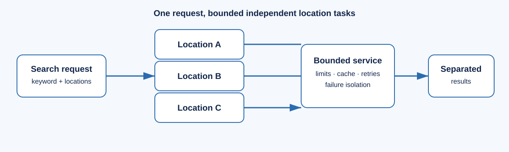

# How Lociqua works

Lociqua accepts records from permitted sources and uses a provider interface to
search stored data. The local database provider does not contact third-party
services. Any additional provider must be explicitly configured by the operator
and used only under its applicable terms.

For a multi-location search, each locality becomes an independent bounded task.
The orchestrator limits concurrency, coalesces identical in-flight work, applies
timeouts and retry policy, and returns structured task errors instead of failing
an entire batch. Production deployments can queue longer-running batches through
Redis and a separate worker.

Imports normalize names, websites, domains, phone numbers, and categories.
Records preserve source identifiers; quality information identifies missing or
basic-format fields; duplicate candidates contain explainable reasons. A human
decision changes only the review state, never the stored company records.

Next: [architecture](ARCHITECTURE.md) or [user guide](USER_GUIDE.md).
