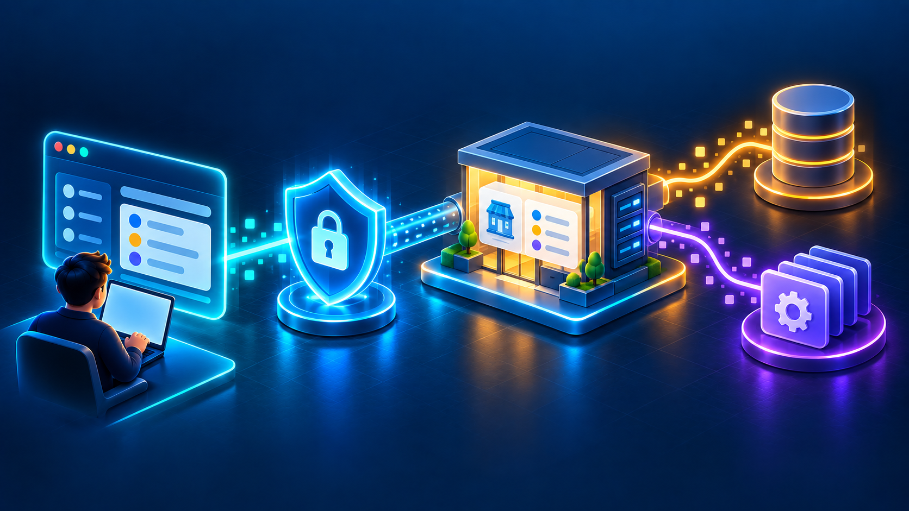
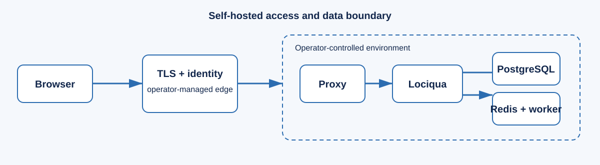

# Self-hosting Lociqua



Lociqua is software your organisation runs and operates. This guide explains the
local production-style Docker setup; it does not turn your deployment into a
hosted global directory or replace your own security review.



Lociqua's production profile runs the application, worker, PostgreSQL/PostGIS,
Redis, and reverse proxy through Docker Compose. It is designed for one
configured workspace and must be operated by someone responsible for identity,
secrets, data rights, backups, and monitoring.

## Start locally

1. Install Docker Desktop and confirm `docker compose version` works.
2. Copy `.env.example` to `.env` locally. Generate unique values for every
   password and secret; never commit, paste, or publish `.env`.
3. Start the stack from the repository root:

   ```powershell
   docker compose -f docker-compose.production.yml up --build -d --remove-orphans
   docker compose -f docker-compose.production.yml ps
   Invoke-WebRequest http://127.0.0.1/healthz
   Invoke-WebRequest http://127.0.0.1/readyz
   ```

4. Open `http://127.0.0.1/` and sign in using the bootstrap account.

## Public HTTPS access

For public access, place the reverse proxy behind an operator-managed TLS and
identity layer. Cloudflare Tunnel plus Cloudflare Access is one supported
operator choice; it provides public HTTPS and an external access policy, while
Lociqua still enforces its own application roles. Configure an allow policy
before sharing the hostname.

## Upgrades and shutdown

Before upgrades, take and verify a backup. Rebuild with the Compose command
above, then run health and smoke checks. Stop the stack with:

```powershell
docker compose -f docker-compose.production.yml down
```

Do not use `down -v` on a live deployment: it removes local Docker volumes.
See the [operations runbook](OPERATIONS.md) for backup, recovery, alerting,
rollback, and secret rotation procedures.
