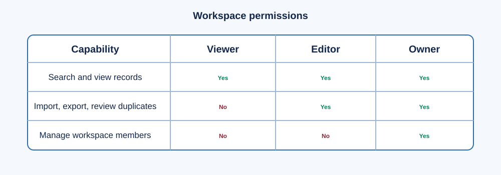

# Lociqua user guide

If you are new to business-data tools, begin with [first steps](FIRST_STEPS.md).

## 1. Sign in

In a production deployment, first pass the operator's HTTPS and identity
boundary, then sign in with the Lociqua account created for your workspace. Do
not share passwords or bearer tokens.

## 2. Import permitted CSV data

Choose **Import**, select a UTF-8 CSV with a `name` column, and import only data
your organization owns or is allowed to provide. Useful optional columns include
`categories`, `website`, `phone`, `address`, `locality`, `city`, and `country`.

The import report shows accepted and rejected rows. Correct rejected rows in the
original file, rather than editing unknown data in place.

## 3. Search several locations

Choose **Search**, enter a keyword and one locality per line, then run the
search. Results are grouped by the requested location. Selecting a result opens
its company detail view.

## 4. Review quality, provenance, and history

Open a company to view its quality score, missing fields, source records,
field-level provenance, and audit history. A lower score is a review signal, not
a statement that the company is invalid.

## 5. Review duplicate candidates

Editors and owners can open **Duplicate review**. Each candidate shows both
records, an explainable score, and the matching reasons. Choose **Approve match**
or **Reject match**. Both records remain stored; the decision is reversible by a
later operational review because no destructive merge occurs.

## 6. Export and access control

Exports require an authenticated editor or owner. Share exports only under the
same data-rights conditions as the source. Owners can create users, change roles,
or revoke access.

Next: [self-hosting](SELF_HOSTING.md) or [data rights and security](SECURITY_AND_DATA_RIGHTS.md).

## 7. Capture permitted web evidence

When an owner has approved a source policy, an editor can use the optional
Chrome/Edge extension while viewing that permitted website normally. The editor
chooses the fields, previews them, and confirms capture. Lociqua stores the URL,
source policy, time, reviewer state, and field provenance. It does not browse
sites automatically or collect Google/Maps results.

Read [authorised web research](AUTHORIZED_WEB_RESEARCH.md) before enabling the
extension.
